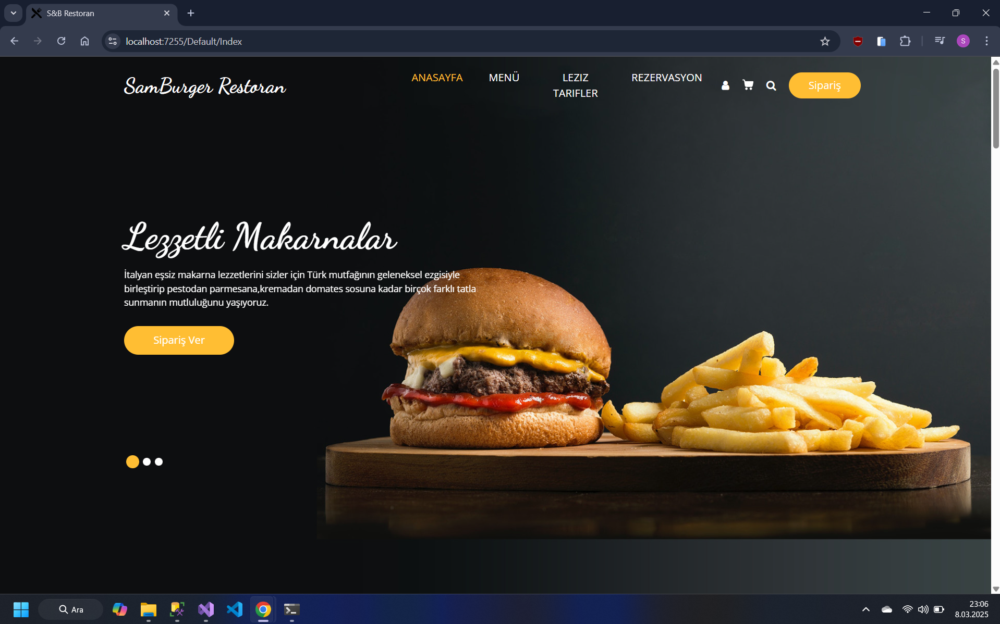
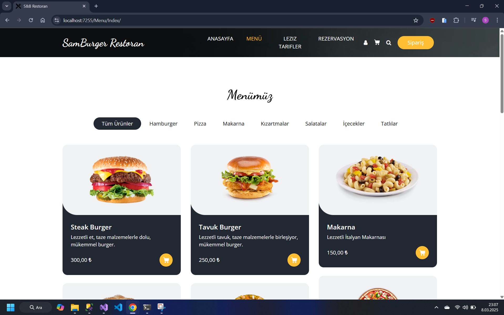
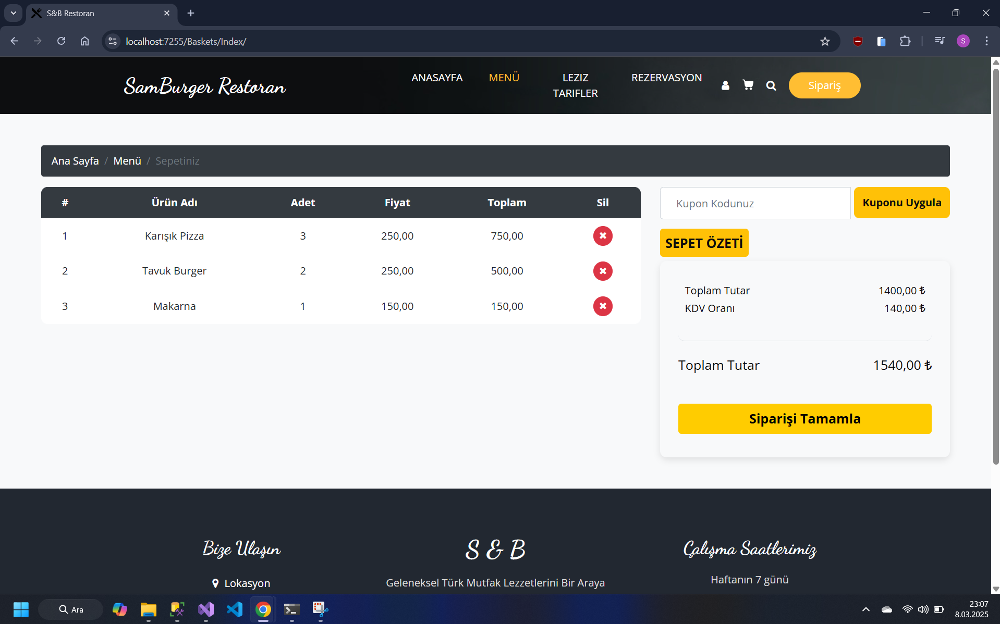
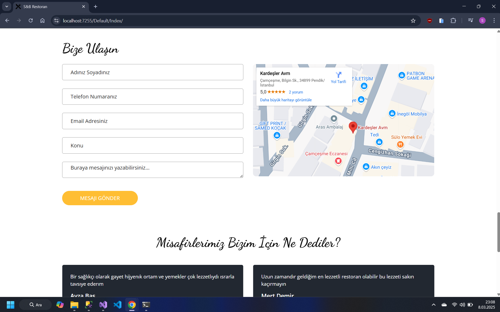
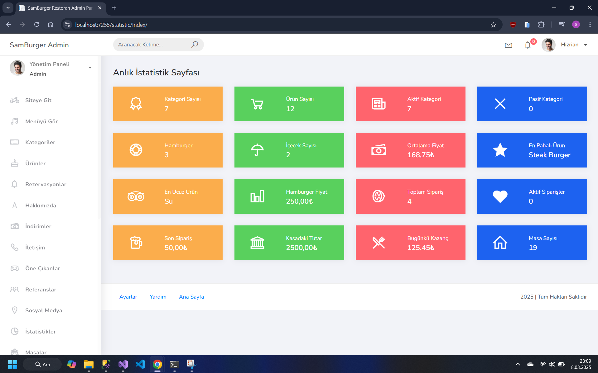
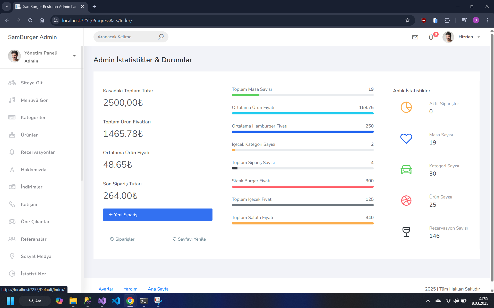
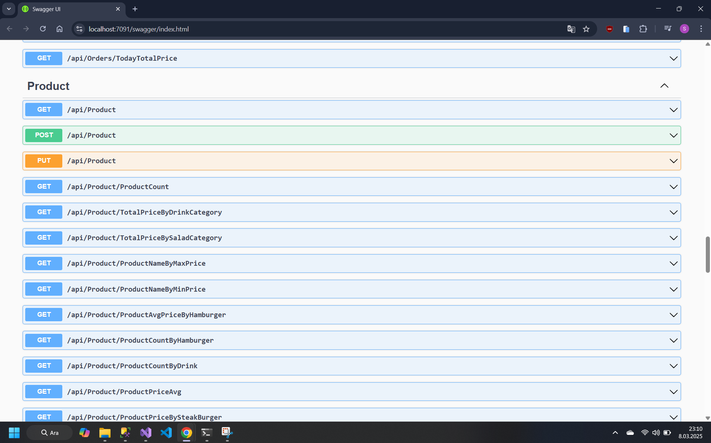

# Restoran Yönetim Sistemi - N-Tier Architecture ve SignalR

**Restoran Yönetim Sistemi**, **ASP.NET Core 6.0** kullanılarak geliştirilmiş gerçek zamanlı bir sipariş yönetim sistemidir. Bu proje, **N-Tier Architecture** kullanarak modüler ve ölçeklenebilir bir yapı sunarken, **SignalR** ile anlık bildirimler, mesajlaşma ve gerçek zamanlı istatistikler sağlamaktadır.

Bu sistem, restoran işletmelerinin sipariş süreçlerini verimli bir şekilde yönetmelerini kolaylaştırırken, kullanıcı deneyimini artırmak için anlık güncellemeler sunmaktadır.

## 📌 Ana Özellikler
- **N-Tier Architecture**: Katmanlı mimari ile esnek ve sürdürülebilir bir yapı.
- **SignalR**: Gerçek zamanlı bildirimler, mesajlaşma ve canlı sepet güncellemeleri.
- **Gerçek Zamanlı Sipariş Yönetimi**: Kullanıcılar siparişlerini canlı olarak takip edebilir.
- **Admin Paneli**: Sipariş ve rezervasyonların merkezi bir noktadan yönetimi.
- **Mail Bildirimleri**: Kullanıcıların rezervasyon ve sipariş durumları hakkında bilgilendirilmesi.

## 📂 Proje Yapısı

```bash
SignalRProject
├── SignalRProject.BusinessLayer  
├── SignalRProject.DataAccessLayer       
├── SignalRProject.EntityLayer 
├── SignalRProject.API          
├── SignalRProject.WebUI        
```
## 🖼️ Proje Görselleri








